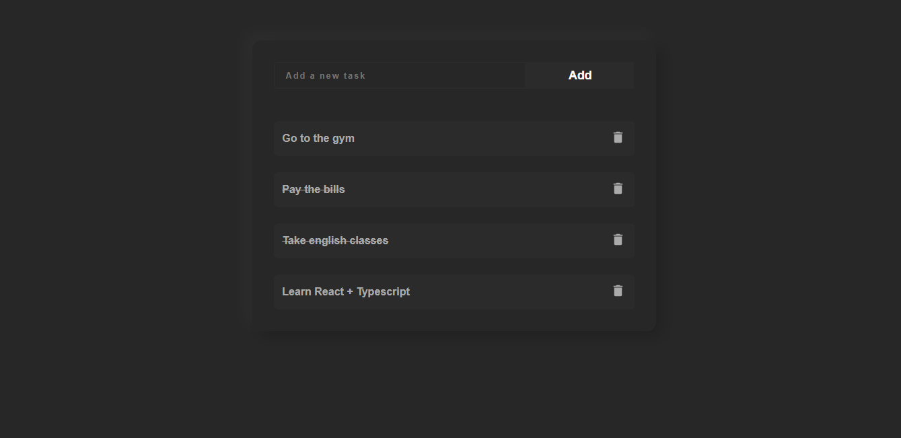

<h1 align="center">React-TS Tasks - Diogo Jorge</h1>

<h1 align="center">
    <a href="https://diogofernandoj-ts-tasks" target="blank">
        
        <small align="center">Clique para visitar o projeto🔗</small>
    </a>
</h1>

## 📕 Sobre

Meu primeiro projeto React com Typescript, na verdade é um projeto que eu ja havia realizado, mas resolvi refaze-lo para fixar meus conhecimentos, e implementar o Typescript.

## ⚙ Ferramentas utilizadas

Para este projeto utilizei as seguintes tecnologias:

- CSS3
- React
- Typescript
